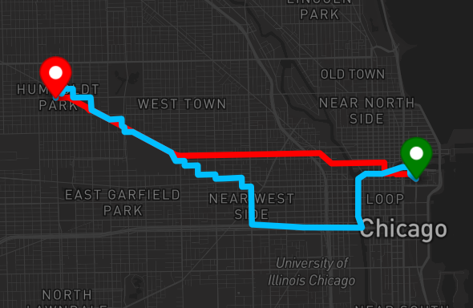
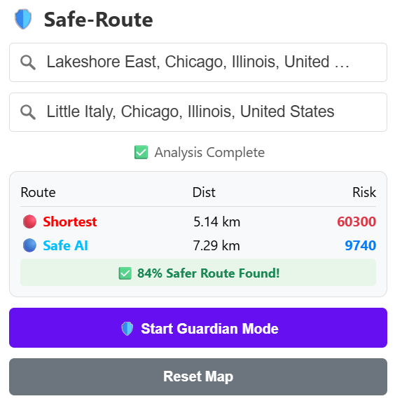
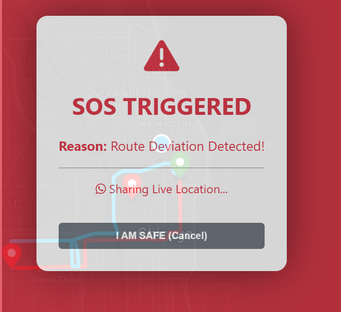

# 🛡️ Safe-Route: AI-Driven Crime-Aware Navigation System

**Safe-Route** is an intelligent navigation application designed to prioritize user safety over speed. Unlike standard mapping services that optimize purely for distance, Safe-Route utilizes machine learning and historical crime data to generate routes that avoid high-danger zones. It features a "Guardian Mode" that monitors user movement in real-time and triggers automated SOS alerts via WhatsApp.

## 🚀 Key Features

* **🛡️ Dual-Route Comparison:** Simultaneously calculates and visualizes two paths:
    * **Red Line (Risky):** The standard shortest path (Dijkstra's Algorithm on Distance).
    * **Blue Line (Safe):** The AI-optimized path (Dijkstra's Algorithm on Safety Weights).
* **📊 Quantitative Safety Analytics:** Displays a "Risk Score" for each route, showing users exactly how much safer the AI route is (e.g., *"71% Safer"*).
* **👮 Guardian Mode:** A real-time monitoring system that watches the user's journey.
    * **Route Deviation Detection:** Triggers an alert if the user strays from the safe path.
    * **Suspicious Stoppage Detection:** Detects if the user stops moving for an extended period in a danger zone.
* **🚨 Automated SOS System:** Automatically opens WhatsApp with a pre-filled emergency message and a **Live Location Link** when a threat is detected.
* **🔥 Heatmap Visualization:** Renders a high-performance heatmap of 500,000+ crime data points to visualize danger zones in Chicago.

## 🛠️ Tech Stack

* **Backend:** Python, Flask, Pandas, NumPy
* **AI & Graph Logic:** NetworkX, OSMnx (OpenStreetMap), Scikit-Learn (KD-Tree for nearest neighbor search)
* **Frontend:** HTML5, CSS3, JavaScript
* **Mapping API:** Mapbox GL JS (Vector Maps & Geocoding)
* **Data Source:** Chicago Police Department (ClearMap) Crime Dataset

## ⚙️ How It Works

1.  **Data Ingestion:** The system loads over **500,000 crime records** and maps them to the nearest street intersections using a **KD-Tree** spatial index.
2.  **Graph Weighting:** A weighted graph of the city's road network is built where every road segment (edge) is assigned a "Danger Cost" based on the frequency and severity of crimes nearby.
3.  **Pathfinding:** When a user requests a route, the backend runs **Dijkstra’s Algorithm** twice—once to minimize distance and once to minimize the "Danger Cost."
4.  **Real-Time Monitoring:** The frontend simulates GPS tracking. If the user's coordinates deviate from the safe path coordinates by a set threshold, the **Guardian Logic** initiates the SOS protocol.

## 📸 Project Demo

### 1. Dual-Route Comparison (Red vs. Blue)

### 2. Analytics & Safety Score

### 3. Guardian Mode & SOS

## 🔮 Future Scope

* Integration with real-time crowd-sourced safety ratings.
* Mobile application development using React Native.
* Expansion to support multiple cities beyond Chicago.

---

**Developed by PAPAREDDY HESHMITHA SAI** | *Final Year Project 2026*